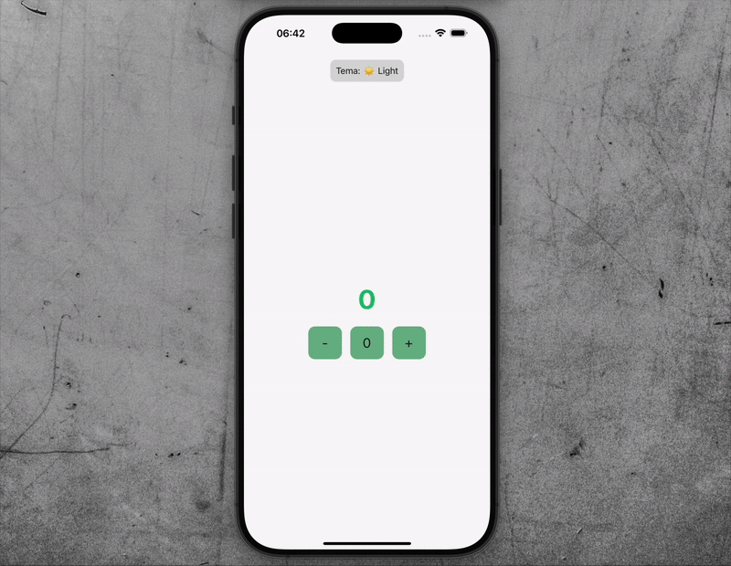

# Counter/Sayac App

Bu proje, React Native ve Redux Toolkit kullanılarak geliştirilmiş bir **sayaç uygulamasıdır**. Kullanıcılar sayacı arttırabilir, azaltabilir ya da sıfırlayabilir. Uygulama ayrıca kullanıcı isteğine göre **karanlık (dark) ve aydınlık (light)** tema geçişini de destekler.

## 🚀 Özellikler

- 🔼 **Arttırma**: Sayaç değeri 1 artar.
- 🔽 **Azaltma**: Sayaç değeri 0’a kadar azalır. Negatif olamaz.
- 🔁 **Sıfırlama**: Sayaç değeri sıfırlanır.
- **Tema Değiştirme**: Kullanıcı light/dark temalar arasında geçiş yapabilir.
- **Redux** ile merkezi state yönetimi.

# Kullanılan Teknolojiler

- React Native
- Redux
- React Redux

# GIF

# sayac_reactNative
